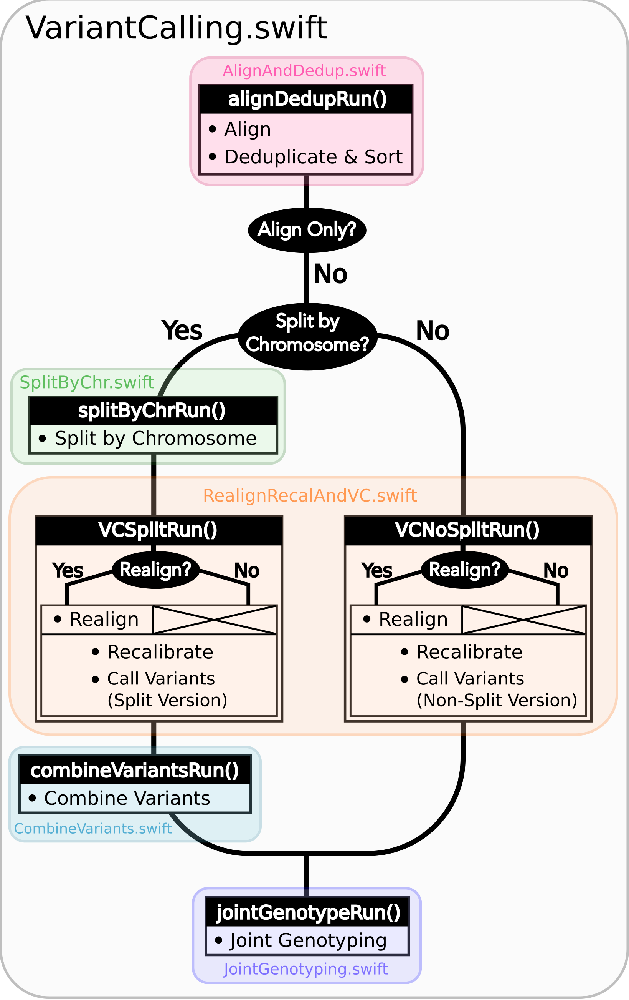

# Variant Calling with Swift-T

**Table of Contents**

- [Variant Calling with Swift-T](#variant-calling-with-swift-t)
	- [Intended pipeline architecture and function](#intended-pipeline-architecture-and-function)
	- [Installation](#installation)
		- [Dependencies](#dependencies)
		- [Workflow Installation](#workflow-installation)
	- [User Guide](#user-guide)
		- [Runfile Options](#runfile-options)
		- [Running the Pipeline](#running-the-pipeline)
			- [Requesting Resources from the Job Scheduler](#requesting-resources-from-the-job-scheduler)
			- [Executing the Swift-T Application](#executing-the-swift-t-application)
				- [PBS Torque (general)](#pbs-torque-general)
				- [PBS Torque (alternative)](#pbs-torque-alternative)
				- [Cray System (Like Blue Waters at UIUC)](#cray-system-like-blue-waters-at-uiuc)
			- [Logging Options](#logging-options)
		- [Output Structure](#output-structure)
		- [Data preparation](#data-preparation)
		- [Resource Requirements](#resource-requirements)
		- [Pipeline Interruptions and Continuations](#pipeline-interruptions-and-continuations)
			- [Background](#background)
			- [Example](#example)
		- [Logging functionality](#logging-functionality)
			- [Important Notes](#important-notes)
	- [Under The Hood](#under-the-hood)
	- [Troubleshooting](#troubleshooting)

## Intended pipeline architecture and function

This pipeline implements the [GATK's best practices](https://software.broadinstitute.org/gatk/best-practices/) for germline variant calling in Whole Genome and Whole Exome Next Generation Sequencing datasets, given a cohort of samples.

This pipeline was disigned for GATK 3.X, which include the following stages:

1.  Map to the reference genome
2.  Mark duplicates
3.  Perform indel realignment and/or base recalibration (BQSR)\*
4.  Call variants on each sample
5.  Perform joint genotyping

\* The indel realignment step was recommended in GATK best practices \< 3.6). 

Additionally, this workflow provides the option to split the aligned reads by chromosome before calling variants, which often speeds up performance when analyzing WGS data. 


**Figure 1:** Overview of Workflow Design

## Installation

### Dependencies

|  **Step**          |  **Tool options**                                                             |
| --------------------| ------------------------------------------------------------------------------|
|  Alignment          | [Bwa mem](https://github.com/lh3/bwa) or [Novoalign](http://novocraft.com/)   |
|  Sorting            | [Novosort](http://novocraft.com/)                                             |
|  Marking Duplicates | [Samblaster](https://github.com/GregoryFaust/samblaster), [Novosort](http://novocraft.com/), or [Picard](https://broadinstitute.github.io/picard/)                                                    |
|  Indel Realignment  | [GATK](https://software.broadinstitute.org/gatk/download/)                    |
|  Base Recalibration | [GATK](https://software.broadinstitute.org/gatk/download/)                    |
|  Variant Calling    | [GATK](https://software.broadinstitute.org/gatk/download/)                    |
|  Joint Genotyping   | [GATK](https://software.broadinstitute.org/gatk/download/)                    |
|  Miscellaneous      | [Samtools](http://samtools.github.io/)                                        |
 
### Workflow Installation

Clone this repository

## User Guide
The workflow is controlled by modifying the variables contained within a runfile.

A `template.runfile` is packaged within this repo.

From this file, one specifies how the workflow is ran

### Runfile Options

**`SAMPLEINFORMATION`**

The file that contains the paths to each sample's reads, where each sample is on its own line in the form: `SampleName /path/to/read1.fq /path/to/read2.fq`. Alternatively, if analyzing single-end reads, the format is simply: `SampleName /path/to/read1.fq`

_It is necessary that no empty line is inserted at the end of this file_

**`OUTPUTDIR`** The path that will serve as the root of all of the output files generated from the pipeline (See `Figure 2`)

**`TMPDIR`** The path to where temporary files will be stored (See `Figure 2`)

**`REALIGN`** YES if one wants to realign before recalibration, NO if not.

**`SPLIT`** YES if one wants to split-by-chromosome before calling variants, NO if not.

**`PROGRAMS_PER_NODE`**

Sometimes it is more efficent to double (or even triple) up runs of an application on the same nodes using half of the available threads than letting one run of the application use all of them. This is because many applications only scale well up to a certain number of threads, and often this is less than the total number of cores available on a node.

Under the hood, this variable simply controls how many threads each tool gets. If `CORES_PER_NODE` is set to 20 but `PROGRAMS_PER_NODE` is set to 2, each tool will use up to 10 threads. 

**!!!!!!!!! IMPORTANT NOTE !!!!!!!!!** It is up to the user at runtime to be sure that the right number of processes are requested per node when calling Swift-T itself (See the `Running the Pipeline` section), as this is what actually controls how processes are distributed.

**`CORES_PER_NODE`** Number of cores within nodes to be used in the analysis. For multi-threaded tools, the number of threads = `CORES_PER_NODE/PROGRAMS_PER_NODE`

**`EXIT_ON_ERROR`**

If this is set to `YES`, the workflow will quit after a sample fails quality control.

If set to `NO`, the workflow will let samples fail, and continue processing all of those that did not. The workflow will only stop if none of the samples remain after the failed ones are filtered out.

This option is provided because for large sample sets one may expect a few of the input samples to fail quality control, and it may be acceptable to keep going if a few fail. However, exercise caution and monitor the `Failures.log` generated in the `DELIVERYFOLDER/docs` folder to gauge how many of the samples are failing.

**`ALIGN_DEDUP_STAGE`; `CHR_SPLIT_STAGE`; `VC_STAGE`; `COMBINE_VARIANT_STAGE`; `JOINT_GENOTYPING_STAGE`**

These variables control whether each stage is ran or skipped (only stages that were successfully run previously can be skipped, as the "skipped" option simply looks for the output files that were generated from a previous run.)

Each of these stage variables can be set to `Y` or `N`. In addition, all but the last stage can be set to `End`, which will stop the pipeline after that stage has been executed (think of the `End` setting as shorthand for "End after this stage")

See the **Pipeline Interruptions and Continuations** Section for more details.

**PAIRED** 0 if reads are single-ended only; 1 if they are paired-end reads

**ALIGNERTOOL; MARKDUPLICATESTOOL**

| **Process**     | **Setting**                           |
| ----------------|---------------------------------------|
| Alignment       | `BWAMEM` or `NOVOALIGN`               |              
| Mark Duplicates | `SAMBLASTER`, `PICARD`, or `NOVOSORT` |

**`BWAINDEX`; `NOVOALIGNINDEX`** Depending on the tool being used, one of these variables specify the location of the index file

**`BWAMEMPARAMS`; `NOVOALIGNPARAMS`**

This string is passed directly as arguments to the tool as (an) argument(s)

Example, `BWAMEMPARAMS=-k 32 -I 300,30`

Note: There is no space between the '=' character and your parameters
Note: Do not set the thread count or paired/single-ended flags, as they are taken care of by the workflow itself

**`CHRNAMES`**

List of chromosome/contig names separated by a ':'

Examples:
* `chr1:chr2:chr3`
* `1:2:3`

Note: chromosome names must match those found in the files located in the directory that `INDELDIR` points to, as well as those in the reference fasta files

**`NOVOSORT_MEMLIMIT`**

Novosort is a tool that used a lot of RAM. If doubling up novosort runs on the same node, this may need to be reduced to avoid an OutOfMemory Error. Otherwise, just set it to most of the RAM on a node. _You need to set this value regardless of you analysis scenario_

This is set in bytes, so if you want to limit novosort to using 30 GB, one would set it to `NOVOSORT_MEMLIMIT=30000000000`

**`MAP_CUTOFF`** The minimum percentage of reads that were successfully mapped in a successful alignment

**`DUP_CUTOFF`** The maximum percentage of reads that are marked as duplicates in a successful sample

**`REFGENOMEDIR`** Directory in which the reference genome resides

**`REFGENOME`** Name of the reference genome (name only, not full path)

**`DBSNP`** 

Name of the dbsnp vcf file (name only, path should be that of the REFGENOMEDIR)

**`INDELDIR`** 

Directory that contains the standard indel variant files used in the realignment/recalibration step

Within the directory, the vcf files should be named with only the chromosome name in front and nothing else.

For example, if the chromosome is `chr12` or `12`, name the vcf files `chr12.vcf` or `12.vcf`, respectively.

If not splitting by chromosome, the workflow will look for all of the vcf files in the directory.

**`OMNI`** \< Insert explanation here \> Not currently used in workflow

**`JAVAEXE`; `BWAEXE`; `SAMBLASTEREXE`; `SAMTOOLSEXE`; `NOVOALIGNEXE`; `NOVOSORTEXE`**

Full path of the appropriate executable file

**`PICARDJAR`; `GATKJAR`** Full path of the appropriate jar file

### Running the Pipeline

#### Requesting Resources from the Job Scheduler

Swift-T works by opening up multiple "slots", called processes, where applications can run. There are two types of processes this workflow allocates
* SERVERS - Control the execution of Swift-T itself; all Swift-T applications must have at least one of these
* WORKERS - Run the actual work of each application in the workflow; these will make up the vast majority of processes

Controlling various aspects of the job submission is achieved by setting environment variables to the desired values. For example, the user can fine control the total number of processes needed by setting `PROCS=<Number of MPI processes>`, and/or the number of workers via `TURBINE_WORKERS` and the number of servers via `ADLB_SERVERS`. Similarly, one can specify `QUEUE`, `WALLTIME` and `PROJECT` specifications. More coverage of these is provided in [the Swift/T sites guide](http://swift-lang.github.io/swift-t/sites.html#variables).

Other options allow control of logging options. Especially for users unfamiliar with Swift/T, we recommend always setting the environment variable `ADBL_DEBUG_RANKS=1` and checking the beginning of the Swift/T log to be sure processes are being allocated as the user expects.

Often when we use a cluster we set the `ppn` variable to the number of cores on each node, but with Swift/T this usually needs to be set to the number of processes opened on each node (unless a particular cluster configuration allocates resources differently). =====> **Jacob, this is really to say that ppn is number of processes on each node, but it is not neccesarily the number of cores on each node, right?**  **Do we need to state this, or is it sufficient to refer the user to the guide link above, and show this in the examples/discussions of systems below?**

For convenience, we recommend setting all such environment variables in a file, and then adding it to the Swift/T command. This is shown in the sections below for different schedulers (pbs, cray, slurm).

#### Executing the Swift-T Application 

If using multiple nodes, one should set the `SWIFT_TMP` to another location besides the default `/tmp`, that is shared by all of the nodes

For example,
`export SWIFT_TMP=/path/to/home/directory/temp`

**The type of job scheduler dictates how one calls Swift-T**

##### PBS Torque (general)

Usually, one can use swift-t's built-in job launcher for PBS Torque schedulers (calling swift-t with `-m pbs`)

```
$ cat settings.sh		# For convenience, we save all environment variables in a file named settings.sh for example
export PPN=<PROGRAMS_PER_NODE>
export NODES=<#samples/PROGRAMS_PER_NODE + (1 or more)>
export PROCS=$(($PPN * $NODES))
export WALLTIME=<HH:MM::SS>
export PROJECT=<Project ID>
export QUEUE=<queue>
export SWIFT_TMP=/path/to/directory/temp

# (Optional variables to set)
export TURBINE_LOG=1
export ADBL_DEBUG_RANKS=1
export TURBINE_OUTPUT=/path/to/output_log_location

$ swift-t -m pbs -O3 -s settings.sh -o /path/to/where/compiled/should/be/saved/compiled.tic -I /path/to/Swift-T-Variant-Calling/src/ -r /path/to/Swift-T-Variant-Calling/src/bioapps /path/to/Swift-T-Variant-Calling/src/VariantCalling.swift -runfile=/path/to/your.runfile
```
This command will compile and run the pipeline all in one command, and the flags used in this call do the following:

* `-O3` Conduct full optimizations of the Swift-T code during compilation (Even with full optimizations, compilation of the code takes only around 3 seconds)
* `-m pbs` The job scheduler type, pbs torque in this case
* `-s settings.sh` The file with environment variables' settings for the scheduler
* `-o` The path to the compiled swift-t file (has a .tic extension); on the first run, this file will be created.
* `-I` This includes some source files that are imported during compilation
* `-r` This includes some tcl package files needed during compilation
* `-n` The number of processes (ranks) Swift-T will open for this run of the workflow **(this overrides the PROCS specification above, so I'm not sure we should use both -- ask/advise)**
* `-runfile` The path to the runfile with all of the configuration variables for the workflow


##### PBS Torque (alternative)

If you need to import a module to use Swift/T (as is the case on iForge at UIUC), one cannot simply use the swift-t launcher as outlined above, since the module load command is not part of the qsub file that Swift-t generates and submits.

This command must be included (along with any exported environment variables and module load commands) in a job submission script and not called directly on a head/login node.

`swift-t -O3 -o </path/to/compiled_output_file.tic> -I /path/to/Swift-T-Variant-Calling/src -r /path/to/Swift-T-Variant-Calling/src/bioapps -n < Node# * PROGRAMS_PER_NODE + 1 or more > /path/to/Swift-T-Variant-Calling/src/VariantCalling.swift -runfile=/path/to/example.runfile`

It is important to note that (at least for PBS Torque schedulers) when submitting a qsub script, the `ppn` option should be set, not to the number of cores on each compute node, but to the number of WORKERS Swift-T needs to open up on that node. 

**Example**

If one is wanting to run a 4 sample job with `PROGRAMS_PER_NODE` set to 2 in the runfile (meaning that two BWA runs can be executing simultaneously on a given node, for example), one would set the PBS flag to `-l nodes=2:ppn=2` and the `-n` flag when calling the workflow to 5 \( nodes\*ppn + 1 \)

##### Cray System (Like Blue Waters at UIUC)

This call of the workflow requires many more environmental variables and no submission script: Swift-T itself will create and submit a job.

Additionally, to get the right number of processes on each node to make the `PROGRAMS_PER_NODE` work correctly, one must set `PPN= PROGRAMS_PER_NODE` and `NODES` to `#samples/PROGRAMS_PER_NODE + (1 or more)`, because at least one process must be a Swift-T SERVER. If one wanted to try running 4 samples on 2 nodes but with `PPN=3` to make room for the processes that need to be SERVER types, one of the nodes may end up with 3 of your WORKER processes running simultaneously, which may lead to memory problems when Novosort is called.

(The exception to this would be when using a single node. In that case, just set `PPN=#PROGRAMS_PER_NODE + 1`)

So, with that understanding, call swift-t in the following way:
```
$ cat settings.sh
export PPN=<PROGRAMS_PER_NODE>
export NODES=<#samples/PROGRAMS_PER_NODE + (1 or more)>
export PROCS=$(($PPN * $NODES))
export WALLTIME=<HH:MM:SS>
export PROJECT=<Project ID>
export QUEUE=<Queue>
export SWIFT_TMP=/path/to/directory/temp

# CRAY specific settings:
export CRAY_PPN=true

# (Optional variables to set)
export TURBINE_LOG=1    # This produces verbose logging info; great for debugging
export ADBL_DEBUG_RANKS=1	# Displays layout of ranks and nodes
export TURBINE_OUTPUT=/path/to/log/directory	# This specifies where the log info will be stored; defaults to one's home directory

$ swift-t -m cray -O3 -n $PROCS -o /path/to/where/compiled/should/be/saved/compiled.tic \
-I /path/to/Swift-T-Variant-Calling/src/ -r /path/to/Swift-T-Variant-Calling/src/bioapps \
/path/to/Swift-T-Variant-Calling/src/VariantCalling.swift -runfile=/path/to/your.runfile
```

Swift-T will create and run the qsub command for you.

##### SLURM based Systems (Like Biocluster2 at UIUC, and Stampede1/Stampede2 on XSEDE)

As in the case with the pbs-based clusters, it is sufficient to only specify the scheduler using `-m slurm`, and then proceed as above. Additionaly, the same `settings.sh` file can be used, except that the user can also instruct the scheduler to send email notifications as well. The example below clarifies these:

```
$ cat settings.sh
export PPN=<PROGRAMS_PER_NODE>
export NODES=<#samples/PROGRAMS_PER_NODE + (1 or more)>
export PROCS=$(($PPN * $NODES))
export WALLTIME=<HH:MM:SS>
export PROJECT=<Project ID>
export QUEUE=<Queue>
export SWIFT_TMP=/path/to/directory/temp

# SLURM specific settings
export  MAIL_ENABLED=1 
export  MAIL_ADDRESS=<the desired email address for sending notifications- on job start, fail and finish >
export TURBINE_SBATCH_ARGS=<Other optional arguments passed to sbatch, like --exclusive and --constraint=.. etc>

# (Optional variables to set)
export TURBINE_LOG=1    # This produces verbose logging info; great for debugging
export ADBL_DEBUG_RANKS=1	# Displays layout of ranks and nodes
export TURBINE_OUTPUT=/path/to/log/directory	# This specifies where the log info will be stored; defaults to one's home directory

$ swift-t -m slurm -O3 -n $PROCS -o /path/to/where/compiled/should/be/saved/compiled.tic \
-I /path/to/Swift-T-Variant-Calling/src/ -r /path/to/Swift-T-Variant-Calling/src/bioapps \
/path/to/Swift-T-Variant-Calling/src/VariantCalling.swift -runfile=/path/to/your.runfile

```

#### Logging Options

While the outputs generated by all the tools of the workflow itself will be logged in the log folders within the `OUTDIR` structure, Swift-T generates a log itself that may help debug if problems occur.

Setting the environment variable `TURBINE_LOG=1` will make the log quite verbose

Setting `ADBL_DEBUG_RANKS=1` will allow one to be sure the processes are being allocated to the nodes in the way one expects

### Output Structure


**Figure 2:** Output directories and files generated from a typical run of
the pipeline

### Data preparation

For this pipeline to work, a number of standard files for calling variants are needed (besides the raw reads files which can be fastq/fq/fastq.gz/fq.gz), namely these are the reference sequence and database of known variants (Please see this [link](https://software.broadinstitute.org/gatk/guide/article?id=1247)).

For working with human data, one can download most of the needed files from [the GATK’s resource bundle](http://gatkforums.broadinstitute.org/gatk/discussion/1213/whats-in-the-resource-bundle-and-how-can-i-get-it). Missing from the bundle are the index files for the aligner, which are specific to the tool that would be used for alignment (i.e., bwa or novoalign in this pipeline)

Generally, for the preparation of the reference sequence, the following link is a good start [the GATK’s guidelines](http://gatkforums.broadinstitute.org/wdl/discussion/2798/howto-prepare-a-reference-for-use-with-bwa-and-gatk).

If splitting by chromosome for the realignment/recalibration/variant-calling stages, the pipeline needs a separate vcf file of known variants for each chromosome/contig, and each should be named as: `*${chr_name}.vcf` . Further, all these files need to be in the `INDELDIR` which should be within the `REFGENOMEDIR` directory as per the runfile.

### Resource Requirements

The table below describes the number of does each stage needs to achieve the maximum level of parallelism. One can request fewer resources if necessary, but at the cost of having some portions running in series.

|  **Analysis Stage**                                               |  **Resource Requirements**
| -----------------------------------------------------------------  | -------------------------
| Alignment							      | Nodes = Samples / (PROGRAMS_PER_NODE\*)
| Deduplication and sorting					       | Nodes = Samples / (PROGRAMS_PER_NODE\*)
| Split by Chromosome/Contig					        | Nodes = (Samples * Chromosomes)/ PROGRAMS_PER_NODE\*
| Realignment, Recalibration, and Variant Calling (w/o splitting by chr)| Nodes = Samples / (PROGRAMS_PER_NODE\*)
| Realignment, Recalibration, and Variant Calling (w/ splitting by chr) | Nodes = (Samples * Chromosomes)/ PROGRAMS_PER_NODE\*
| Combine Sample Variants                         		       | Nodes = Samples / (PROGRAMS_PER_NODE\*)
| Joint Genotyping						      | Nodes = 1\*\*

\* PROGRAMS_PER_NODE is a variable set in the runfile. Running 10 processes using 20 threads in series may actually be slower than running the 10 processes in pairs utilizing 10 threads each

\*\* The call to GATK's GenotypeGVCFs must be done on a single node. It is best to separate out this stage into its own job submission, so as to not waste unused resources.

### Pipeline Interruptions and Continuations

#### Background

Because of the varying resource requirements at various stages of the pipeline, the workflow allows one to stop the pipeline at many stages and jump back in without having to recompute.

This feature is controlled by the STAGE variables of the runfile. At each stage, the variable can be set to "Y" if it should be computed, and "N" if that stage was completed on a previous execution of the workflow. If "N" is selected, the program will simply gather the output that should have been generated from a previous run and pass it to the next stage.

In addition, one can set each stage but the final one to "End", which will stop the pipeline after that stage has been executed. Think of "End" as a shorthand for "End after this stage".

#### Example

If splitting by chromosome, it may make sense to request different resources at different times.

One may want to execute only the first two stages of the workflow with # Nodes = # Samples. For this step, one would use these settings:

```
ALIGN_STAGE=Y
DEDUP_SORT_STAGE=Y
CHR_SPLIT_STAGE=End         # This will be the last stage that is executed
VC_STAGE=N
COMBINE_VARIANT_STAGE=N
JOINT_GENOTYPING_STAGE=N
```

Then for the variant calling step, where the optimal resource requirements may be something like # Nodes = (# Samples \* # Chromosomes), one could alter the job submission script to request more resources, then use these settings:

```
ALIGN_STAGE=N
DEDUP_SORT_STAGE=N
CHR_SPLIT_STAGE=N
VC_STAGE=End                # Only this stage will be executed
COMBINE_VARIANT_STAGE=N
JOINT_GENOTYPING_STAGE=N
```

Finally, for the last two stages, where it makes sense to set # Nodes = # Samples again, one could alter the submission script again and use these settings:

```
ALIGN_STAGE=N
DEDUP_SORT_STAGE=N
CHR_SPLIT_STAGE=N
VC_STAGE=N
COMBINE_VARIANT_STAGE=Y
JOINT_GENOTYPING_STAGE=Y
```

This feature was designed to allow a more efficient use of computational resources.

### Logging functionality

The provided scripts allow you to check out the trace of a successful run of the pipeline. To invoke it, and for the time being, you need R installed in your environment along with the `shiny` package. 

To do so, proceed as follows:

1. Go to the [R-project webpage](http://ftp.heanet.ie/mirrors/cran.r-project.org/), and follow the instructions based on your system
2. Once the step above is completed and R is installed, open a terminal window, type `R`, then proceed as follows:

```
if (!require(shiny)) {
	install.packages('shiny')
	library(shiny)
}
runGitHub(repo = "jacobrh91/Swift-T-Variant-Calling", ref = "master",
          subdir = "src/plotting_app" )
```

The first time you run these commands in your system it will also install some libraries for you in case you don't have them already, namely: `lubridate, tidyverse and forcats`.

Once all is done, a webpage should open up for you to actually take a look at your trace files. For a taste of how things look, you may take a look at the sample `Timing.log` file provided [in the repo](https://github.com/jacobrh91/Swift-T-Variant-Calling/master/src/plotting_app)

To take a look at your own analysis trace, you need to have a copy of this branch first, Run it on you samples, and then find your own `Timing.log` file within `Results_folder_path/delivery/docs`. Simply upload this file, and start using the app.

#### Important Notes

One problem spotted from using the app with 2 samples is that the analysis is done for only one of them (the realignment/recalibration stages are problemetic, where sampleNames get swapped haphazardly, and only one sample gets fully analyzed, which is what the supplied example `Timing.log` file shows - **this needs a closer look**)

It should also be noted that running this pipeline in its current form is expected to be more expensive than normal, due to the manual logging involved. The alternative is to use the native `MPE` library (or equivalent), which requires re-compiling the Swift/T source. This approach is **currently limited at the moment**, but some discussions with the Swift/T team on this is found on their [repo ](https://github.com/swift-lang/swift-t/issues/118)

## Under The Hood



**Figure 3:** Program Structure

Each Run function has two paths it can use to produce its output:
1. One path actually performs the computations of this stage of the pipeline
2. The other skips the computations and just gathers the output of a prior execution of this stage. This is useful when one wants to jump into different sections of the pipeline, and also allows Swift/T's dependency driven execution to correctly string the stages together into one workflow.

## Troubleshooting

**General Troubleshooting Tips**

Regardless of the platform, one can use the following environmental variables to better debug the workflow:

`ADLB_DEBUG_RANKS=1` One can see if the processes are spread across the nodes correctly

`TURBINE_LOG=1` Makes the Swift-T log output very verbose
`TURBINE_LOG_FILE=<filePath>` Changes the Swift-T log output from StdOut to the file of choice

More debug info can be found [here](http://swift-lang.github.io/swift-t/guide.html)

* The pipeline seems to be running, but then prematurely stops at one of the tools?
  * Solution: make sure that all tools are specified in your runfile up to the executable itself (or the jar file if applicable)

* The realignment/recalibration stage produces a lot of errors or strange results?
  * Solution: make sure you are preparing your reference and extra files (dbsnp, 1000G,...etc) according to the guidelines in the [Data Preparation](#data-preparation) section

* Things that should be running in parallel appear to be running sequencially
  * Solution: make sure you are setting the `-n` flag to a value at least one more than `PROGRAMS_PER_NODE` * `NODES`, as this allocates processes for Swift/T itself to run on

* The job is killed as soon as BWA is called?
  * Solution: make sure there is no space in front of `BWAMEMPARAMS`
    * DO-THIS:  `BWAMEMPARAMS=-k 32 -I 300,30`
    * NOT-THIS: `BWAMEMPARAMS= -k 32 -I 300,30`

* I'm not sure how to run on a cluster that uses torque as a resource manager?
  * Clusters are typically configured to kill head node jobs that run longer than a few minutes, to prevent users from hogging the head node. Therefore, you may qsub the initial job, the swift-t command with its set variables, and it will qsub everybody else from its compute node.

