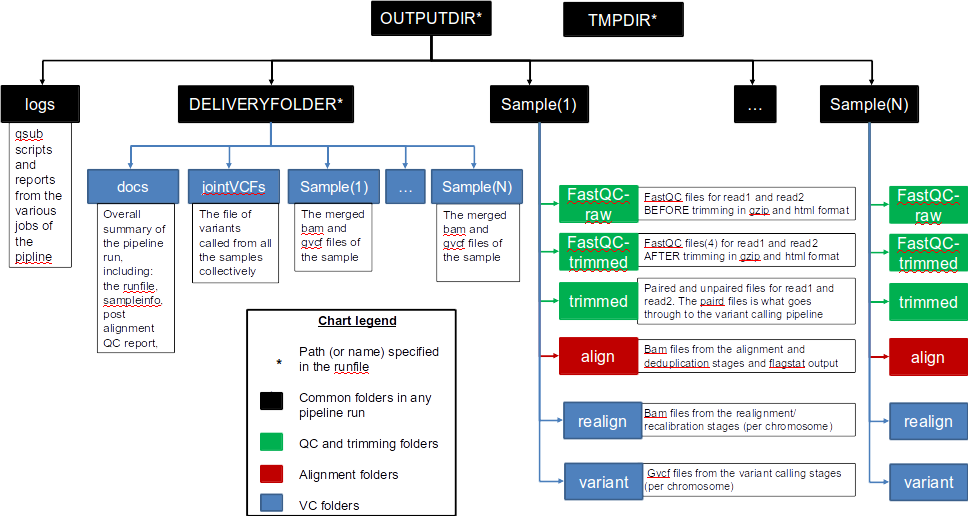

# Intro

## Intended pipeline architecture and function

This pipeline implements the [GATK's best practices](https://software.broadinstitute.org/gatk/best-practices/) for germline variant calling in Whole Genome and Whole Exome Next Generation Sequencing datasets, given a cohort of samples.

This pipeline was disigned for GATK 3.X, which include the following stages:

1.  Map to the reference genome

2.  Mark duplicates

3.  Perform indel realignment and/or base recalibration (BQSR)\*

4.  Call variants on each sample

5.  Perform joint genotyping

\* The indel realignment step was recommended in GATK best practices \< 3.6). 

Additionally, this workflow provides the option to split the aligned reads by chromosome before calling variants, which often speeds up performance when analyzing WGS data. 


**Figure 1** Overview of Workflow Design

# Installation


## Dependencies

|  **Stage**          |  **Tool options**                                                             |
| --------------------| ------------------------------------------------------------------------------|
|  Alignment          | [Bwa mem](https://github.com/lh3/bwa) or [Novoalign](http://novocraft.com/)   |
|  Sorting            | [Novosort](http://novocraft.com/)                                             |
|  Marking Duplicates | [Samblaster](https://github.com/GregoryFaust/samblaster), [Novosort](http://novocraft.com/), or [Picard](https://broadinstitute.github.io/picard/)                                                    |
|  Indel Realignment  | [GATK](https://software.broadinstitute.org/gatk/download/)                    |
|  Base Recalibration | [GATK](https://software.broadinstitute.org/gatk/download/)                    |
|  Variant Calling    | [GATK](https://software.broadinstitute.org/gatk/download/)                    |
|  Joint Genotyping   | [GATK](https://software.broadinstitute.org/gatk/download/)                    |
|  Miscellaneous      | [Samtools](http://samtools.github.io/)                                        |
 

## Workflow Installation

Clone this repository

# User Guide
The workflow is controlled by modifying the variables contained within a runfile.
**TO-DO**: add a template runfile 

From this file, one specifies how the workflow is ran

## Runfile Options

### SAMPLEINFORMATION

The file that contains the paths to each sample's reads

Each sample is on its own line in the following form:
* SampleName /path/to/read1.fq /path/to/read2.fq

If analyzing single-end reads, the format is simply:
* SampleName /path/to/read1.fq

### OUTPUTDIR

The path that will serve as the root of all of the output files generated from the pipeline See Figure XXXXXXXXXX)

### DELIVERYFOLDER

Name of the delivery folder (See Figure XXXXXXXX)

### TMPDIR

The path to where temporary files will be stored

### ANALYSIS

Set the type of analysis being conducted:

| **Analysis**                          | **Setting**                           |
| --------------------------------------|---------------------------------------|
|  Alignment only                       | ALIGN, ALIGN_ONLY, or ALIGNMENT       |
|  Variant Calling with Realignment     | VC_REALIGN                            |
|  Variant Calling without Realignment  | \<Any other input\>                   |

### SPLIT

YES if one wants to split-by-chromosome before calling variants, NO if not.

### PROCPERNODE

This stands for processes per node.

Sometimes it is more efficent to double (or even triple) up runs of an application on the same nodes using half of the available threads than letting one run of the application use all of them. This is because many applications only scale well up to a certain number of threads, and often this is less than the total number of cores available on a node.

Under the hood, this variable simply controls how many threads each tool gets. If PBSCORES is set to 20 but PROCPERNODE is set to 2, each tool will use up to 10 threads. It is up to the user at runtime to be sure that the right number of processes are requested per node when calling Swift-T itself (See section XXXXXXXXXXXXXX), as this is what actually controls how processes are distributed.

### EXIT_ON_ERROR

If this is set to YES, the workflow will quit after a fatal error occurs in any of the samples.

If set to NO, the workflow will let samples fail, and continue processing all of those that did not. The workflow will only stop if none of the samples remain after the failed ones are filtered out.

This option is provided because for large sample sets one may expect a few of the input samples to be malformed in some way, and it may be acceptable to keep going if a few fail. However, exercise caution and monitor the Failures.log generated in the DELIVERYFOLDER/docs folder to gauge how many of the samples are failing.


## Resource Requirements

|  **Analysis Stage**                              |  **Resource Requirements**
| ------------------------------------------------ | -------------------------
|  Alignment and Deduplication                     | Nodes = Samples / (Processes per Node\*)
|  Split by Chromosome/Contig                      | Processes = Samples * Chromosomes<br>Nodes = Processes/ (Cores per Node)
|  Realignment, Recalibration, and Variant Calling | Nodes = [Samples / (Processes per Node\*)] * Chromosomes
|  Combine Sample Variants                         | Nodes = Samples / (Processes per Node\*)
** Table 1: Pipeline tools **


\*Running 10 processes using 20 threads in series may actually be slower than running the 10 processes in pairs utilizing 10 threads each

## Pipeline Interruptions and Continuations

Because of the varying resource requirements at various stages of the pipeline, the workflow allows one to stop the pipeline at many stages and jump back in without having to recompute.

This feature is controlled by the STAGE variables of the runfile.

# Under The Hood


**Figure 2: Program Structure**

Each Main function has two paths it can use to produce it's output:
1. One path actually performs the computations of this stage of the pipeline
2. The other skips the computations and just gathers the output of a prior execution of this stage. This is useful when one wants to jump into different sections of the pipeline, and also allows Swift/T's dependency driven execution to correctly string the stages together into one workflow.

2 Dependencies
==============

2.1 Software tools
------------------

The pipeline should implement the stages of Figure \[1\], while allowing different software tools at some of the stages depending on user's preference. These are as shown in table \[1\] below, and it is assumed that users would specify the full path to each of them in their runfile as shown in section 2.3.

Table 1: Pipeline tools


2.2 Data preparation
---------------------------

For this pipeline to work, a number of standard files for calling variants are needed (besides the raw reads files which can be fastq/fq/fastq.gz/fq.gz), namely these are the reference sequence and database of known variants (Please see this [link](https://software.broadinstitute.org/gatk/guide/article?id=1247)). Further, the full path to all these needs to be specified in the User’s runfile as specified in section 2.3

For working with human data, one can download most of the needed files from [the GATK’s resource bundle](http://gatkforums.broadinstitute.org/gatk/discussion/1213/whats-in-the-resource-bundle-and-how-can-i-get-it). Missing from the bundle are the index files for the aligner, which are specific to the tool that would be used for alignment (i.e., bwa or novoalign in this pipeline)

Generally, for the preparation of the reference sequence, the following link is a good start [the GATK’s guidelines](http://gatkforums.broadinstitute.org/wdl/discussion/2798/howto-prepare-a-reference-for-use-with-bwa-and-gatk).

To achieve the parallelization of Figure \[1\] in the realignment/recalibration stages, the pipeline needs a separate vcf file of known variants for each chromosome/contig, and each should be named as: `*${chr_name}.vcf` . Further, all these files need to be in the 
`INDELDIR` which should be within the `REFGENOMEDIR` directory as per the runfile.
If working with the GATK bundle, the sample script ([*splitVCF-by-chromosome.sh*](https://github.com/HPCBio/BW_VariantCalling/blob/ParameterSweep/splitVCF-by-chromosome.sh)) can be used to produce the needed files with some minor modifications (mainly, providing the right path to the referencedir, java and GenomeAnalysisTK.jar)

2.3 User’s runfile and sample information files
-----------------------------------------------

To run a specific stage of the pipeline, in addition to specifying the needed script file, the user needs to supply 2 additional files, these are the runfile and the sampleinfo files.

The `sampleinformation` file contains the information about the samples to be processed by the pipeline. In its current implementation, it can analyze paired end WES/WGS data in fastq/fq/fastq.gz/fq.gz format only. These should be specified in tabular form of 3 columns separated by ‘space’, and according to the format below:
```
sample_name full/path/to/read1file full/path/to/read2/file
```
The `runfile` file contains all the details regarding a specific run of the pipeline, including the tools of section 2.1, resources of section 2.2, and the sampleinformation file path as well. It would change depending on the analysis type required.

In a nutshell, the template below shows the various parameters and how they can be specified. It should be noted that the pipeline is case sensitive to the parameters’ names.

  -------------------------------------------------------------------------------------------------------------------------------------------------------------------------------------------------------------------------------------------------------------------------------------------------
```
## i/o
  SAMPLEINFORMATION=<path to the sampleinformation file>
  OUTPUTDIR=<path to the output directory>
  DELIVERYFOLDER=<path where summary deliverables from the pipeline are stored. It is a subdirectory within the OUTPUTDIR>
  TMPDIR=<path to where temporary files are stored>
  SCRIPTDIR=<path to where the scripts of this repo are stored locally on the machine>
  EMAIL=<email address to send torque notifications to\*>
  REPORTTICKET=<redmine ticket number to send notifications to\*>

## choose the run case
  ANALYSIS=<depending on the analysis type it can be {ANALYSIS=ALIGNMENT, or ANALYSIS=ALIGN or ANALYSIS=ALIGN\_ONLY} for alignment only, {ANALYSIS=VC\_WITH\_REALIGNMENT} for complete variant calling with realignment, or anything else for complete variant calling without realignment>
  SPLIT=<choose whether to split by chromosome or not> {YES|Yes|yes|Y|y or <Anything else> for No}
  PROCPERNODE=<Integer: how many processes should be ran on each node. Number of threads multi-threaded tools use = PBSCORES/PROCPERNODE>

## choose the stages that will be executed (E means the pipeline with stop after this stage is executed)
  ALIGN_DEDUP_STAGE={Y|N|E}
  CHR_SPLIT_STAGE={Y|N|E}
  VC_STAGE={Y|N|E}
  COMBINE_VARIANT_STAGE={Y|N|E}
  JOINT_GENOTYPING_STAGE={Y|N}

## Read group information for the samples: namely, the Library, Platform technology, and sequencing center name. It should be noted that the sample ID, platform unit (PU) and sample name (SM) are set by default to be the same sample name found in the sampleinformation file specified
  SAMPLELB=<name of the library>
  SAMPLEPL=<should be either ILLUMINA, SOLID, LS454, HELICOS or PACBIO>
  SAMPLECN=<name of the sequencing center generating the reads>

## tools to be used
  ALIGNERTOOL=<the tool to be used for the alignment stage of the pipeline. Can be either BWAMEM or NOVOALIGN. Only the respective INDEX and PARAMS need to be specified in the next block of the runfile>
  MARKDUPLICATESTOOL=<the tool to be used for marking duplicates in the pipeline. Can be any of these: samblaster, novosort or PICARD>

## Alignment block parameters and Trimming options.
  BWAINDEX=<Path to the indexed reference file for bwa, if it is the desired aligner >
  BWAMEMPARAMS=<optional parameters to bwa mem, if used as an aligner. Example: -k 32 -I 30,30>
  NOVOALIGNINDEX=<path to the indexed reference file for novoalign, if it is the desired aligner>
  NOVOALIGNPARAMS=<optional parameters to novoalign, if used as an aligner>
  CHRNAMES=<a colon (:) separated list of chromosome or contig names to split files by. Only these regions will be processed in the stages following the alignment>

## Quality thresholds (for reporting only, as the pipeline will continue with the next stage regardless of whether these thresholds were respected or not):
  MAP_CUTOFF=<minimum mapping quality of reads to pass QC test after alignment>
  DUP_CUTOFF=<maximum duplication level in reads to pass QC test after alignment>

## paths to resources and tools - See section 2.1 and 2.2
  REFGENOMEDIR=<path to the directory where all reference files and databases are stored>
  REFGENOME=<name of the reference genome file within REFGENOMEDIR. Example ucsc.hg19.fasta in the GATK bundle 2.8>
  DBSNP=<name of the dbsnp file within REFGENOMEDIR. Example dbsnp\_138.hg19.vcf in the GATK bundle 2.8>
  INDELDIR=<name of the directory within REFGENOMEDIR that contains a vcf file for each chromosome/contig specified by the CHRNAMES parameter. These files need to be named as: \*\${chr\_name}.vcf >
  OMNI=<name of the omni variants file. Example: 1000G\_omni2.5.hg19.sites.vcf in the GATK bundle 2.8>

# Example entries for tools’ path in biocluster. Note that for all tools the variables correspond to the executable file itself
  BWAMEMDIR=/home/apps/bwa/bwa-0.7.15/bwa
  NOVOALIGNDIR=/home/apps/novocraft/novocraft-3.02/novoalign
  NOVOSORTDIR=/home/apps/novocraft/novocraft-3.02/novocraft
  SAMBLASTERDIR=/home/apps/samblaster/samblaster-0.1.22/bin/samblaster
  PICARDIR=/home/apps/picard-tools/picard-tools-2.4.1/picard.jar
  GATKDIR=/home/apps/gatk/gatk-3.6
  SAMDIR=/home/apps/samtools/samtools-1.3.1/bin/samtools
  JAVADIR=/home/apps/java/jdk1.8.0\_65/bin/java/GenomeAnalysisTK.jar

## pbs torque resources**
  PBSNODES=<number of nodes>
  PBSCORES=<number of cores>
  PBSQUEUE=<name of the queue>
  PBSWALLTIME=<wall time>
  
  ```

  -------------------------------------------------------------------------------------------------------------------------------------------------------------------------------------------------------------------------------------------------------------------------------------------------

\* These are needed to track the execution of the various pipeline stages. See section 2.5 for more details
\*\* Note that `pbs torque resources` shoule be specified according to the resource manager your system is using. See section 3.2 below for more details

2.4 Repo index and outputs
---------------------------

The code implementing the pipeline of Figure 1 above are all in the `VCcallingPipeline.swift` file. All supporting functions and modules have been defined in the directory named, `pipelinefunctions`.

The results from a typical run of the pipeline are organized according to the hierarchy shown in Figure \[3\] below. Overall, the `DELIVERYFOLDER` contains the key summarizing files of the run (the cleaned up bams, gvcfs and final vcf from joint calling; in addition to the summary reports regarding the quality of the data, and copies of the `sampleinformation` and `runfile` files). Each sample also has its own directory that contains the files generated after each stage. In Figure \[3\], a color coding schema is employed to differentiate the files that would be generated according to how the user specifies the `ANALYSIS` parameter in the `runfile`. For the time being, there are not many ANALYSIS options available. Note the section named *Current limitations*



Figure 3: Output directories and files generated from a typical run of
the pipeline

3 This Pipeline: its usage and limitations
====================================

3.1 Installing Swift/T on a system:
-----------------------------------

Swift/T can be found [publically-installed](http://swift-lang.github.io/swift-t/sites.html#_public_installations on some systems) (but can be probably out-of-date), or it would need to be [built](http://swift-lang.github.io/swift-t/sites.html#_build_procedures). 
In the later case, easiest way is to run the installer directly after downloading the Swift/T package as per the guidelines of the [installation link](http://swift-lang.github.io/swift-t/guide.html#_installation). In some cases additional configurations would be needed as highlighted below:
* PBS torque systems: No specific settings are needed.. Voila!
* Blue Waters: Specific changes to configuration files are needed in this case as per http://swift-lang.github.io/swift-t/sites.html#_blue_waters  .
 *Note:* One needs to follow the instructions for *only either* : the _"public installation":_ *OR* the _build procedure_. The Public installations for Blue Waters date back to 2013, it is probably wiser to stick to the build procedure instructions 
* SunGridEngine based systems: There exists the script: `turbine-sge-run.zsh`, which should be used in this case, but the entry is _not there in the documentation yet_, And The last commit to this file in the github repo reads: " _SGE almost works_")


3.2 Running Swift/T scripts:
---------------------------------------------

The easiest way to run a Swift/T script is:  `swift-t <script.swift>`. However, running java can be problematic within an HPC environment, and the solution is to compile the script on the local machine first, and then to copy the resulting `script.tic` file to the HPC and run it using turbine _provided that versions are the same_. Taking the example of a PBS torque system, these 2 alternative are shown in the example below:

```
$ cat settings.sh
export QUEUE=<PBS torque queue name>
export PPN=<PBS torque ppn (processes per node)>

$ ## The one line solution, on a remote machine:
$ cd path/to/swift-t/scripts
$ swift-t -m pbs -n <number of processes> -s settings.sh <script.swift>

$ ## An alternative in 2 steps:
$ stc <script.swift> # on local machine
$ scp <script.tic> username@hpc_ip_address://path_in_HPC_where you_want_to_put_scripts
$
$turbine -m pbs -n <number of processes> -s settings.sh <program.tic> # on the HPC
```
 
More on this, including other scheduler options are available on: http://swift-lang.github.io/swift-t/sites.html#scheduled_systems 

3.3 Using this pipeline code:
------------------------------------------------

The complete pipeline implementation is available in the Swift/T branch of this github repository: https://github.com/jacobrh91/Swift-T-Variant-Calling 

To run the pipeline, a variant of the stripped-down one-line command below should be invoked:

 ```
swift-t -n <(PBSNODES * PROCPERNODE) + 1 or more > -I /path/to/Swift-T-Variant-Calling/src -r /path/to/Swift-T-Variant-Calling/src/bioapps /path/to/Swift-T-Variant-Calling/src/VariantCalling.swift -runfile=<runfile>
```
* Explanation of -n flag: The total number of workers one wants on a node is PROCPERNODE, which is multiplied by the number of nodes being utilized. However, the Turbine engine itself needs at least 1 process to manage all of the worker processes.


where the runfile is a file containing the details of the run (programs choices and location within the machine, parameters for the programs, some PBS torque settings, output and sampleinformation file locations). (See section 2.3 for more details) 


*Note:* If you need to enable logging of turbine output, you may wish to change some environment variables (this is true if using newer version of Swift/T):

```
export TURBINE_LOG=1 #Enable turbine logging
swift-t -L log_file_name myswift.swift #Enable stc logging (compiler logging)
```
**Figure 2: Program Structure**

Each Main function has two paths it can use to produce it's output:
1. One path actually performs the computations of this stage of the pipeline
2. The other skips the computations and just gathers the output of a prior execution of this stage. This is useful when one wants to jump into different sections of the pipeline, and also allows Swift/T's dependency driven execution to correctly string the stages together into one workflow.


3 This Pipeline: Troubleshooting area (FAQs) 
====================================

- The pipeline seems to be running, but then prematurely stops at one of the tools?
Solution: make sure that all tools are specified in your runfile up to the executable itself (or the jar file if applicable)

- The realignment/recalibration stage produces a lot of errors or strange results?
Solution: make sure you are preparing your reference and extra files (dbsnp, 1000G,...etc) according to the guidelines of section 2.2

- Things that should be running in parallel appear to be running sequencially
Solution: make sure you are setting the -n flag to a value at least one more than PROCPERNODE * PBSNODES, as this allocates MPI processes for Swift/T itself to run

- The job is killed as soon as BWA is called?
Solution: make sure there is no space in front of BWAMEMPARAMS

DO-THIS:  BWAMEMPARAMS=-k 32 -I 300,30

NOT-THIS: BWAMEMPARAMS= -k 32 -I 300,30

- I'm not sure how to run on a cluster  that uses torque as a resource manager?
Clusters are typically configured to kill head node jobs that run longer than a few minutes, to prevent users from hogging the head node. Therefore, you may qsub the initial job, the swift-t command with its set variables, and it will qsub everybody else from its compute node.
