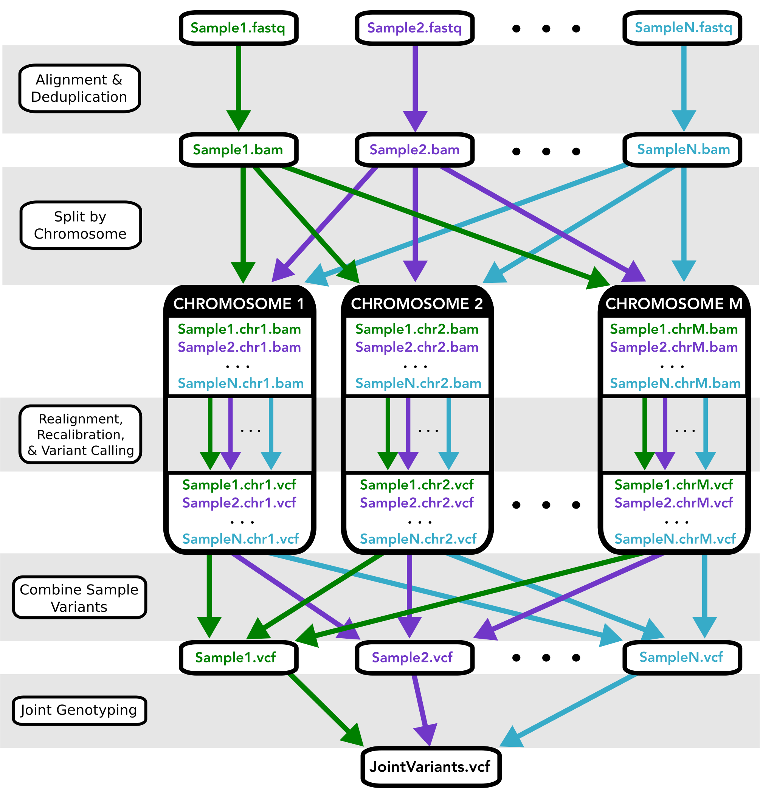

Variant Calling with Swift-T
============================

Intended pipeline architecture and function
-------------------------------------------

This pipeline implements the `GATK's best practices <https://software.broadinstitute.org/gatk/best-practices/>`__ for germline variant calling in Whole Genome and Whole Exome Next Generation Sequencing datasets, given a single sample or a cohort of samples.

This pipeline was disigned for GATK 3.X, which include the following stages:

1. Map to the reference genome
2. Mark duplicates
3. Perform indel realignment and/or base recalibration (BQSR)\*
4. Call variants on each sample
5. Perform joint genotyping

\* The indel realignment step was recommended in GATK best practices <3.6).

Additionally, this workflow provides the option to split the aligned reads by chromosome before calling variants, which often speeds up performance when analyzing WGS data.

An overview of the Workflow architecture is depicted in Figure 1 below

