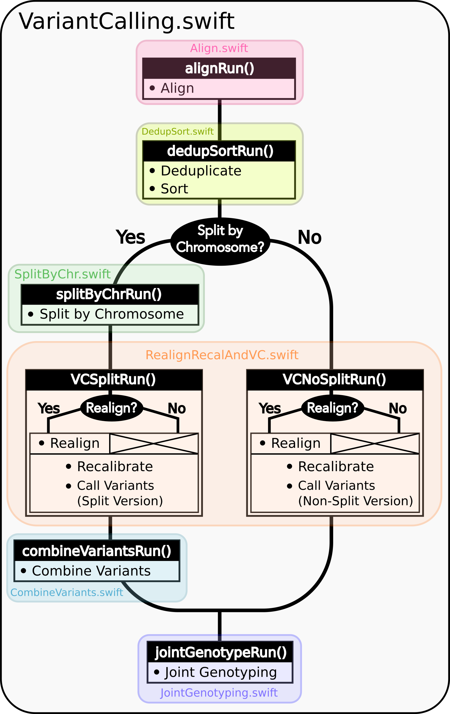

Under The Hood
--------------

Each Run function has two paths it can use to produce its output: 1. One
path actually performs the computations of this stage of the pipeline 2.
The other skips the computations and just gathers the output of a prior
execution of this stage. This is useful when one wants to jump into
different sections of the pipeline, and also allows Swift/T's dependency
driven execution to correctly string the stages together into one
workflow.

